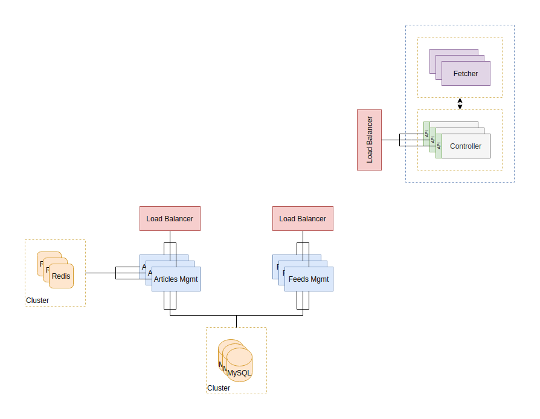

# Design Document

The `News App system` has been split into smaller functional services that have only one responsibility.

The `feeds management service` keeps track of the RSS feeds.

The `articles management service` keeps track of all metadata of all articles for all providers.

The `fetcher service` is responsible for periodically fetching new articles from the RSS providers.

## Design decisions

I decided to use MongoDB for storing the articles metadata as I believe it lands itself well within a document like store. We could accomplish the same thing with a relational database however.

I decided to use a relational database for the feeds management service as all we need is persistence storage with minimal look up functionality.

In any case, we could have swapped both DBs or use only one of them for both services, as this is a fairly simple service and I don't believe database choice, in this case, matters too much.

We'd have to consider this further if we were planing on growing this service, but at that point, we would most certainly have more requirements or at least an idea of the future features we would want these services to have, which would in turn provide more clarity on which database would make more sense for each service.

## Development decisions

There is code in some of these services that could be reused and therefore, in a production grade codebase I'd most definitely be moving that code into their own libraries.

Some examples of that are: logging setup and their corresponding interfaces and implementation, configuration setup (in this case I'd rather use a library like Viper).

## API design decisions

For both APIs we start off with the API version in the path. There are a few ways of versioning APIs, I personally like this method more.

## Git workflow

Normally, I have 3 branches `master`, `test` and `develop` and I usually branch off `develop` to implement features. I then commit frequently to those feature branches and just before merging them I squash all commits in the feature branch into one, so the commit represents one unit of work.

For this project, I will not be doing that given the extra work and the fact that I'm not collaborating with anyone else. Instead, I'll be committing frequently to the master branch.

This applies to all repos belonging to this project.

## Expansion and improvements

This service has no awareness of users preferences. I assume these are being kept in a different service.
If we were in charge of developing the whole application that supports the mobile app, then I'd add another service for user preferences and another one for authentication purposes.

Then, I'd add an extra API (let's call it `entry API`) that would take care of contacting all these services when the client makes a request.

For example: mobile app sends a request to `entry API` asking for all new articles since last time it contacted us. First, this request would have to include either a timestamp of the last time it contacted us or something else that allows us to track when was the last request made.
Then, the `entry API` would first authenticate this request, then contact the user preferences services to get the list of RSS feeds this user had configured and finally make a request to the articles management service to get all the latest articles, and finally send a response back.

Fetcher is a service that could be greatly improved. I touched upon some points on the scalability section, but I want to mention a couple of them here. One is the ability to trigger a fetch asynchronously. Currently, as it stands the fetcher will periodically fetch the RSS feeds. If a user adds a new provider, we need to wait for the next cycle to start in order to see articles related to that provider. A better way of doing this would be to be able to trigger an async fetch to that provider.

Another thing we could improve on the fetcher is to leverage a PUSH service that would notify us of when new articles are available, to avoid the polling mechanism.

If this is not possible or undesirable, we can still improve the fetcher by making the polling time dynamic. Basically, we would have a timer for each provider and adjust it according to the frequency of updates observed.

## Notes

Redis caching is not yet implemented, but if I were to add caching to the articles services, there are two ways we could go about doing this.
First, we can use a TTL for entries, after that TTL expires, entries in the cache would expire. Second, instead of having a TTL, we could support explicit cache eviction. What this would mean is that, every time the fetcher got new articles, upon sending a request to the articles management service to add those new entries, the articles service could then evict entries related to those providers.

I'd do caching based on the filtering parameters, which in this case is `provider` and `category`.

I've recently discovered `groupcache`, created by the original memcache author, and I quite like what it has to offer, especially when it comes to not requiring external dependencies for caching purposes, not to mention replication of hot keys across different instances and what not.
However, because it doesn't support an expiry time and neither does it support explicit cache evictions, we would have to change our caching strategy to be able to use this service.

## High Availability and scalability

The picture below shows how we could scale each service independently.

We can scale the Feeds and Articles management APIs very easily by putting a load balancer in front of these services and having multiple instances of each service.

Both services are stateless simple CRUD services.

Both MySQL and MongoDB can be setup in a cluster to provide resiliency.
We can do the same with Redis.

As for the fetcher service, this one is more trick to scale. The problem is that at the moment, the fetcher service is setup in a way that it sends a request to each RSS provider every X minutes/hours.

If we deploy several instances of this services, then they would all be doing the same work every time. Making unnecessary requests to the feed providers and not accomplishing much.

A better way to setup this service would be to split it into two components. One component's job is to fetch new articles from the feed providers and the other is responsible for queueing up work at a specific times for the fetcher to do the job. Here, we could use a distributed messaging queue system like kafka or rabbitMQ, but I have not detailed that in the diagram above.

With this setup we can have as many `fetcher services` as we would like and if one or more of them goes down, we continue to have a fully functional system.

With regards to the controller, which is the component that decides when to actually fetch for new updates, it's a bit more tricky. Since we can only have one instance deciding at any given time when to trigger new jobs, we could have a sort of quorum being established between the controller instances and voting for who's the master at any given point in time. In that way, we guarantee that only one instance is queueing up jobs at any given point in time.

Another thing I'd add is an API so that we have the option to trigger fetches of RSS feeds asynchronously. One use case for this is when a user decides to add a new RSS URL, we could trigger an immediate fetch to that feed.

Finally, if we want to provide geo-resiliency we can use Anycast VIPs, and let BGP do the work.

A note goes to databases spread across multiple regions. This is a hard problem. I personally prefer to stick with a managed solution when possible, like AWS RDS.
